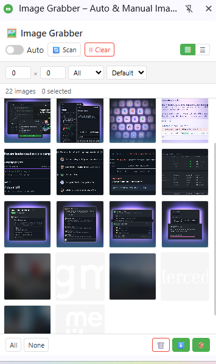

# Image Grabber

[English](README.md) | [中文](README_zh.md) | [Español](README_es.md) | [Deutsch](README_de.md) | [日本語](README_ja.md) | [Français](README_fr.md)

A browser extension that automatically scans webpages for images and enables batch download with one click.

> Chromium-based · Manifest V3 · Zero tracking · Side Panel UI

---

## Features

| Feature | Description |
|---------|-------------|
| 🔍 **Smart Image Detection** | Scans ``, CSS `background-image`, `<video poster>`, `<source srcset>`, and SVG `<image>` |
| 🤖 **Auto Collect** | Real-time monitoring via MutationObserver — new images are collected automatically as you browse |
| 📋 **Grid & List View** | Switch between thumbnail grid and compact table view to browse images your way |
| 🔎 **Filter & Sort** | Filter by minimum dimensions and image type (JPG, PNG, GIF, WebP, SVG); sort by size or name |
| ✅ **Batch Selection** | Select all, deselect all, or pick individual images for bulk operations |
| 🔍 **Lightbox Preview** | Click any image to view full-size with keyboard navigation (← → Esc) |
| ⬇️ **Individual Download** | Download selected images one by one to an `ImageGrabber/` folder |
| 📦 **ZIP Batch Download** | Pack all selected images into a single ZIP file (powered by JSZip) |
| 💾 **Persistent State** | Image lists survive service worker restarts via `chrome.storage.local` |
| 🎯 **Manual Pick** | Click-to-collect mode — hover to highlight, click to grab individual images |
| 🔄 **SPA Support** | Detects SPA navigation (`pushState` / `replaceState` / `popstate`) and re-scans automatically |

---

## Preview

  

---

## Supported Browsers

| Browser | Status |
|---------|--------|
| Google Chrome | ✅ Fully supported (Side Panel) |
| Microsoft Edge | ✅ Fully supported (Side Panel) |
| Other Chromium-based browsers | ✅ Supported (Popup fallback) |

---

## Installation

1. Open your browser's extension page:
   - **Chrome**: `chrome://extensions/`
   - **Edge**: `edge://extensions/`
2. Enable **Developer mode** (top-right toggle)
3. Click **Load unpacked** and select the project folder
4. Click the Image Grabber icon in your toolbar to open the side panel

---

## Usage

1. **Browse any webpage** — The content script runs automatically on all pages
2. **Click the Image Grabber icon** to open the side panel
3. **Enable Auto** — Toggle "Auto" to continuously collect images as the page loads
4. **Or click Scan** — Manually trigger a one-time full-page scan
5. **Manual Pick** — Click 🎯 to enter pick mode, hover to highlight images, click to collect
5. **Filter** — Set minimum width/height, select image type, choose sort order
6. **Switch views** — Toggle between grid (▦) and list (☰) layout
7. **Select** — Click images to select, or use All / None buttons
8. **Preview** — Click any image to open the lightbox, navigate with arrow keys
9. **Download** — Use ⬇️ for individual files or 📦 for a ZIP archive

---

## Privacy

- Required permissions: `storage`, `downloads`, `sidePanel`
- All image processing runs locally in your browser, no external data uploads
- No analytics, user tracking or remote data collection
- All cached image data is stored only in your browser local storage

---

## License

Copyright © 2026 Image Grabber. All rights reserved.

---

> **Note:** This repository is for **project showcase purposes only**. It does not contain the full source code, manifest, icons, or build scripts. Full source code will **not** be published here.

---

## ❤️ Support the Developer

If you find Image Grabber helpful, consider buying me a coffee!

**[👉 Click here to support](https://www.creem.io/payment/prod_4LTHdgvsMSURUjevX47qHE)**
