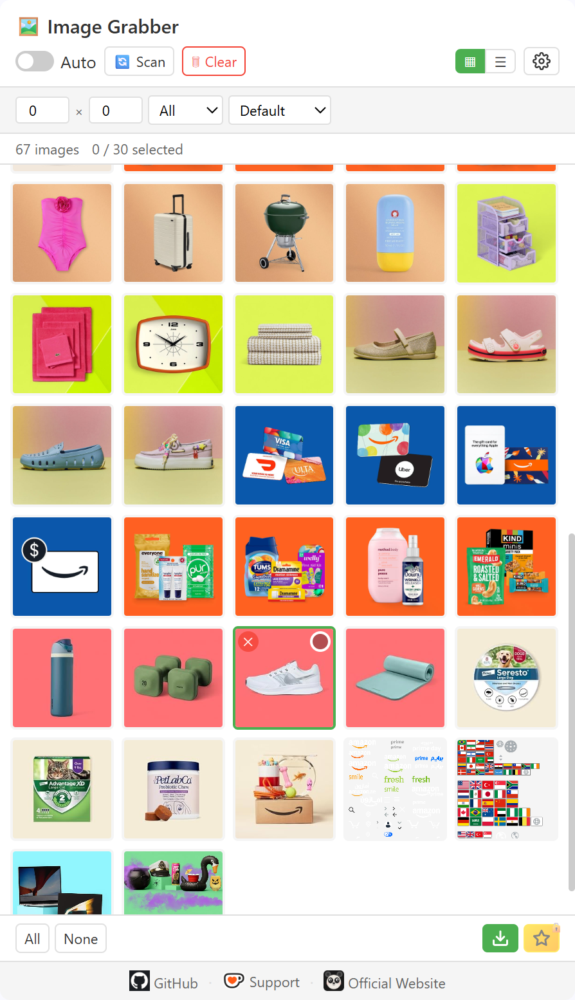

# Image Grabber

[English](README.md) | [中文](languages/README_zh.md) | [Español](languages/README_es.md) | [Deutsch](languages/README_de.md) | [日本語](languages/README_ja.md) | [Français](languages/README_fr.md)

A browser extension that collects images from webpages and enables batch download with one click.

> Chromium-based · Manifest V3 · No tracking · Side Panel UI

---

## Features

### Free Features

| Feature | Description |
|---------|-------------|
| 🔍 **Smart Image Detection** | Scans ``, CSS `background-image`, `<video poster>`, `<source srcset>`, and SVG `<image>` |
| 🤖 **Auto Collect** | Continuously collects images as the page loads (MutationObserver + idle callback) |
| 📋 **Grid & List View** | Switch between thumbnail grid and compact table view |
| 🔎 **Filter & Sort** | Filter by minimum dimensions and image type; sort by width/height/name |
| ✅ **Batch Download** | Single batch download up to **30 images** |
| 🔍 **Lightbox Preview** | Full-size preview with keyboard navigation (← → Esc) |
| ⬇️ **Batch Download** | Download selected images to `ImageGrabber/` folder |
| 💾 **Persistent State** | Image lists survive service worker restarts |
| 🔄 **SPA Support** | Auto re-scan on SPA navigation (`pushState` / `replaceState` / `popstate`) |

### Premium Features (License Required)

| Feature | Description |
|---------|-------------|
| ⭐ **Unlimited Selection** | No 30-image limit — select and download as many as you want |
| 🔬 **pHash Deduplication** | Perceptual hash detects duplicate/similar images even from different URLs |
| 🔄 **Format Conversion** | Convert on download: WebP → JPG, PNG, or any supported format |
| 🗜️ **Image Compression** | Adjust quality and max width to reduce file size |
| ⭐ **Advanced Download** | One-click pipeline: dedup → convert → compress → download |

---

## Free vs Premium

| | Free | Premium |
|---|:---:|:---:|
| Image scanning & browsing | ✅ Unlimited | ✅ Unlimited |
| Batch download limit | 30 images per batch | Unlimited |
| Basic download (original format) | ✅ | ✅ |
| pHash deduplication | — | ✅ |
| Format conversion (WebP→JPG/PNG) | — | ✅ |
| Image compression | — | ✅ |
| Advanced Download pipeline | — | ✅ |

---

## Preview

  

---

## Supported Browsers

| Browser | Status |
|---------|--------|
| Google Chrome | ✅ Fully supported (Side Panel) |
| Microsoft Edge | ✅ Fully supported (Side Panel) |
| Other Chromium-based browsers | ✅ Supported (Popup fallback) |

---

## Installation

1. Open your browser's extension page:
   - **Chrome**: `chrome://extensions/`
   - **Edge**: `edge://extensions/`
2. Enable **Developer mode** (top-right toggle)
3. Click **Load unpacked** and select the project folder
4. Click the Image Grabber icon in your toolbar to open the side panel

---

## Usage

1. **Browse any webpage** — The content script collects images from the current page
2. **Click the Image Grabber icon** to open the side panel
3. **Enable Auto** — Toggle "Auto" to continuously collect images as the page loads
4. **Or click Scan** — Manually trigger a one-time full-page scan
5. **Filter** — Set minimum width/height, select image type, choose sort order
6. **Switch views** — Toggle between grid (▦) and list (☰) layout
7. **Select** — Click images to select (up to 30 for free users)
8. **Preview** — Click any image to open the lightbox
9. **Download** — Click ⬇️ for basic download, or ⭐ for Advanced Download (premium)

### Advanced Download (Premium)

1. Get your license key from [VKT Pricing](https://annmax1983.com/pricing.html)
2. Open Settings (⚙️ gear icon) → enter your license key
3. Configure output format, quality, and deduplication options
4. Select images and click the ⭐ Advanced Download button
5. The pipeline will: deduplicate (if enabled) → convert format → compress → download

---

## Privacy

- Required permissions: `storage`, `downloads`, `sidePanel`
- All image processing runs **locally** in your browser — no external data uploads
- No analytics, user tracking, or remote data collection
- Image data is stored only in your browser local storage
- License validation sends only a device fingerprint hash (hardware-based, no personal data)

---

## Copyright Disclaimer

This extension only provides local image resource viewing and downloading capabilities for users' personal offline sorting and reference. All pictures, illustrations, graphic materials on web pages are protected by copyright and intellectual property laws. Users shall not use batch downloaded images for commercial production, unauthorized reprinting, secondary distribution, mass crawling and other infringing behaviors. All civil and legal liabilities arising from improper use shall be borne solely by the user.

## Crawling Reminder

Do not use this tool to batch capture image resources from websites with copyright protection, anti-crawling mechanisms or clear content usage restrictions. Please abide by the website access rules and local laws when scanning page images.

---

## License

Copyright © 2026 Image Grabber. All rights reserved.

---

> **Note:** This repository is for **project showcase purposes only**. It does not contain the full source code, manifest, icons, or build scripts. Full source code will **not** be published here.

---

## ❤️ Support the Developer

If you find Image Grabber helpful, consider buying me a coffee!

**[👉 Click here to support](https://ko-fi.com/annmax?ref=imagegrabber)**
