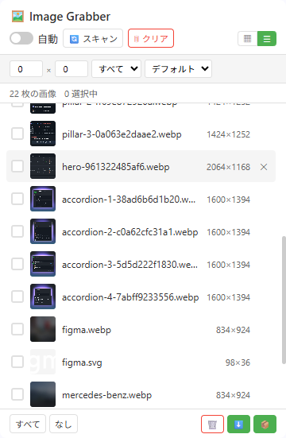

# Image Grabber

[English](README.md) | [中文](README_zh.md) | [Español](README_es.md) | [Deutsch](README_de.md) | [日本語](README_ja.md) | [Français](README_fr.md)

ウェブページから画像を自動スキャンし、ワンクリックでバッチダウンロードを可能にするブラウザ拡張機能。

> Chromium ベース · Manifest V3 · トラッキングなし · サイドパネル UI

---

## 機能

| 機能 | 説明 |
|------|------|
| 🔍 **スマート画像検出** | ``、CSS `background-image`、`<video poster>`、`<source srcset>`、SVG `<image>` をスキャン |
| 🤖 **自動収集** | MutationObserver によるリアルタイム監視 — ブラウジング中に新しい画像を自動収集 |
| 📋 **グリッド＆リスト表示** | サムネイルグリッドとコンパクトテーブル表示を切り替え |
| 🔎 **フィルタ＆ソート** | 最小サイズと画像タイプ（JPG、PNG、GIF、WebP、SVG）でフィルタ；サイズまたは名前でソート |
| ✅ **バッチ選択** | 全選択、全解除、または個別の画像を選択して一括操作 |
| 🔍 **ライトボックスプレビュー** | 任意の画像をクリックしてフルサイズ表示、キーボードナビゲーション対応（← → Esc） |
| ⬇️ **個別ダウンロード** | 選択した画像を1つずつ `ImageGrabber/` フォルダにダウンロード |
| 📦 **ZIP バッチダウンロード** | 選択したすべての画像を単一の ZIP ファイルにパッケージ（JSZip 搭載） |
| 💾 **永続状態** | `chrome.storage.local` によりサービスワーカーの再起動後も画像リストを保持 |
| 🔄 **SPA サポート** | シングルページアプリのナビゲーション（`pushState` / `replaceState` / `popstate`）を検出し自動再スキャン |

---

## プレビュー

  

---

## 対応ブラウザ

| ブラウザ | ステータス |
|----------|-----------|
| Google Chrome | ✅ 完全対応（サイドパネル） |
| Microsoft Edge | ✅ 完全対応（サイドパネル） |
| その他の Chromium ベースブラウザ | ✅ 対応（ポップアップモード） |

---

## インストール

1. ブラウザの拡張機能ページを開く：
   - **Chrome**: `chrome://extensions/`
   - **Edge**: `edge://extensions/`
2. **デベロッパーモード**を有効にする（右上のトグル）
3. **パッケージ化されていない拡張機能を読み込む**をクリックし、プロジェクトフォルダを選択
4. ツールバーの Image Grabber アイコンをクリックしてサイドパネルを開く

---

## 使い方

1. **任意のウェブページを閲覧** — コンテンツスクリプトがすべてのページで自動実行
2. **Image Grabber アイコンをクリック**してサイドパネルを開く
3. **自動を有効化** — 「自動」を切り替えて、ページ読み込み中に画像を継続収集
4. **またはスキャンをクリック** — ページ全体のスキャンを手動で実行
5. **フィルタ** — 最小幅/高さを設定、画像タイプを選択、ソート順を選択
6. **表示切替** — グリッド（▦）とリスト（☰）レイアウトを切り替え
7. **選択** — 画像をクリックして選択、または「すべて」/「なし」ボタンを使用
8. **プレビュー** — 任意の画像をクリックしてライトボックスを開き、矢印キーでナビゲート
9. **ダウンロード** — ⬇️ で個別ファイル、📦 で ZIP アーカイブをダウンロード

---

## プライバシー

- 必要な権限：`activeTab`、`tabs`、`storage`、`downloads`、`scripting`、`sidePanel`
- すべての画像処理はブラウザ内でローカルに実行、外部データアップロードなし
- 分析なし、トラッキングなし、データ収集なし
- キャッシュされた画像データはすべてブラウザのローカルストレージにのみ保存

---

## ライセンス

Copyright © 2026 Image Grabber. All rights reserved.

---

> **注意：** このリポジトリは**プロジェクト展示目的**のみです。完全なソースコード、マニフェスト、アイコン、ビルドスクリプトは含まれていません。完全なソースコードはここでは**公開されません**。

---

## ❤️ 開発者を支援

Image Grabber が役立ったら、コーヒーをおごってくれませんか！

**[👉 こちらをクリックして支援](https://www.creem.io/payment/prod_4LTHdgvsMSURUjevX47qHE)**
