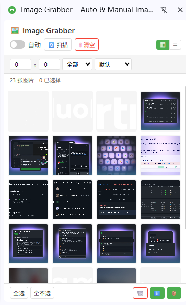

# 图片抓取器

[English](README.md) | [中文](README_zh.md) | [Español](README_es.md) | [Deutsch](README_de.md) | [日本語](README_ja.md) | [Français](README_fr.md)

一款浏览器扩展，自动扫描网页中的图片并支持一键批量下载。

> 基于 Chromium · Manifest V3 · 零追踪 · 侧边栏界面

---

## 功能特性

| 功能 | 说明 |
|------|------|
| 🔍 **智能图片检测** | 扫描 ``、CSS `background-image`、`<video poster>`、`<source srcset>` 和 SVG `<image>` |
| 🤖 **自动采集** | 通过 MutationObserver 实时监控，浏览页面时自动收集新图片 |
| 📋 **网格与列表视图** | 在缩略图网格和紧凑表格视图之间切换 |
| 🔎 **过滤与排序** | 按最小尺寸和图片类型（JPG、PNG、GIF、WebP、SVG）过滤；按尺寸或名称排序 |
| ✅ **批量选择** | 全选、全不选，或单独选取图片进行批量操作 |
| 🔍 **灯箱预览** | 点击任意图片查看大图，支持键盘导航（← → Esc） |
| ⬇️ **单张下载** | 逐张下载选中的图片到 `ImageGrabber/` 文件夹 |
| 📦 **ZIP 打包下载** | 将所有选中图片打包为单个 ZIP 文件（基于 JSZip） |
| 💾 **持久化存储** | 图片列表在 Service Worker 重启后通过 `chrome.storage.local` 保留 |
| 🎯 **手动选取** | 点击采集模式 — 悬停高亮图片，点击即可收集 |
| 🔄 **SPA 支持** | 检测单页应用导航（`pushState` / `replaceState` / `popstate`）并自动重新扫描 |

---

## 预览

  

---

## 支持的浏览器

| 浏览器 | 状态 |
|--------|------|
| Google Chrome | ✅ 完全支持（侧边栏） |
| Microsoft Edge | ✅ 完全支持（侧边栏） |
| 其他 Chromium 浏览器 | ✅ 支持（弹窗模式） |

---

## 安装

1. 打开浏览器扩展页面：
   - **Chrome**：`chrome://extensions/`
   - **Edge**：`edge://extensions/`
2. 开启**开发者模式**（右上角开关）
3. 点击**加载已解压的扩展程序**，选择项目文件夹
4. 点击工具栏中的图片抓取器图标打开侧边栏

---

## 使用方法

1. **浏览任意网页** — 内容脚本会在所有页面上自动运行
2. **点击图片抓取器图标**打开侧边栏
3. **开启自动** — 切换"自动"开关，在页面加载时持续收集图片
4. **或点击扫描** — 手动触发一次全页扫描
5. **手动选取** — 点击 🎯 进入选取模式，悬停高亮图片，点击即可收集
5. **过滤** — 设置最小宽度/高度，选择图片类型，选择排序方式
6. **切换视图** — 在网格（▦）和列表（☰）布局之间切换
7. **选择** — 点击图片进行选择，或使用"全选"/"全不选"按钮
8. **预览** — 点击任意图片打开灯箱，使用方向键导航
9. **下载** — 使用 ⬇️ 下载单个文件或 📦 下载 ZIP 压缩包

---

## 隐私

- 所需权限：`storage`、`downloads`、`sidePanel`
- 所有图片处理均在浏览器本地运行，无外部数据上传
- 无分析、无追踪、无数据收集
- 所有缓存的图片数据仅存储在浏览器本地存储中

---

## 许可证

Copyright © 2026 Image Grabber. 保留所有权利。

---

> **注意：** 本仓库仅用于**项目展示**。不包含完整源代码、清单文件、图标或构建脚本。完整源代码**不会**在此发布。

---

## ❤️ 支持开发者

如果图片抓取器对你有帮助，请考虑请我喝杯咖啡！

**[👉 点击此处支持](https://www.creem.io/payment/prod_4LTHdgvsMSURUjevX47qHE)**
